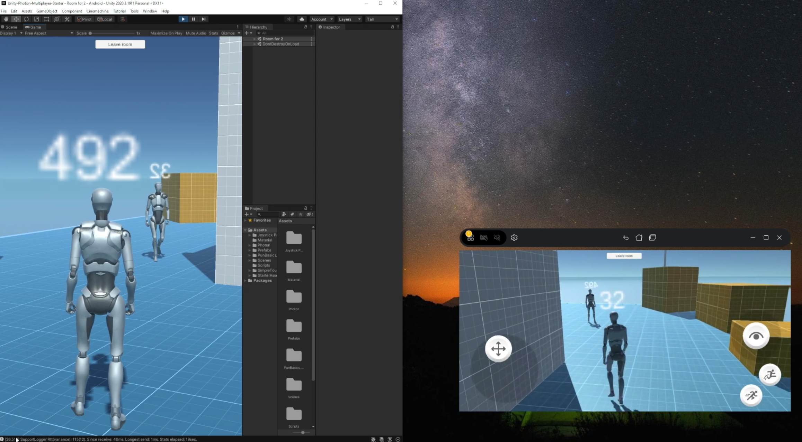

Sure, here's an example README.md file for your Unity game using the Photon plugin:

# Multiplayer Game with Unity and Photon

This is a simple multiplayer game developed with Unity using the Photon plugin. The game features a third-person character for each player, and supports both PC and phone inputs to control the character. The game also has a mechanism for joining and leaving rooms, and rooms are mapped to how many players have joined the game.

## Installation

To install the game, you will need to follow these steps:

1. Clone or download the repository to your local machine.
2. Open the project in Unity.
3. Import the Photon Unity Networking (PUN) plugin from the Unity Asset Store.
4. Set up your Photon account and add your App ID to the PhotonServerSettings in the Assets/Photon/PhotonUnityNetworking/Resources folder.
5. Build the game for your desired platform.

## How to Play

Once you have installed the game, you can start playing it by following these steps:

1. Launch the game and click on the "Play" button.
2. Enter a name for your character and select a room to join. If there are no available rooms, you can create your own room.
3. Once you have joined a room, you will be placed in the game with other players.
4. Use the keyboard or touch controls to move your character and interact with the environment.
5. Enjoy playing the game with other players!

## Demo Video

Watch a demo of the game in action:

## Contributing

If you would like to contribute to the game, you can fork the repository and submit a pull request with your changes. Please make sure to follow the [contribution guidelines](CONTRIBUTING.md) before submitting your pull request.

## Credits

This game was developed by [Your Name] using Unity and the Photon plugin. Special thanks to Photon for providing the networking technology.

## License

This game is licensed under the [MIT License](LICENSE).